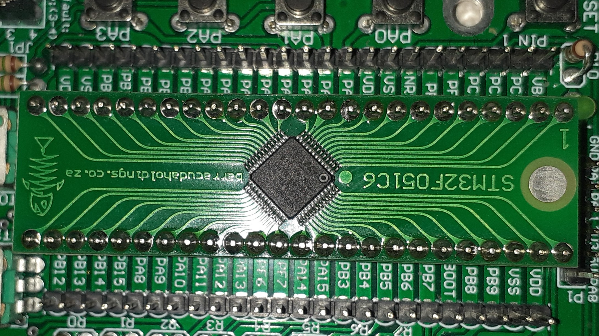
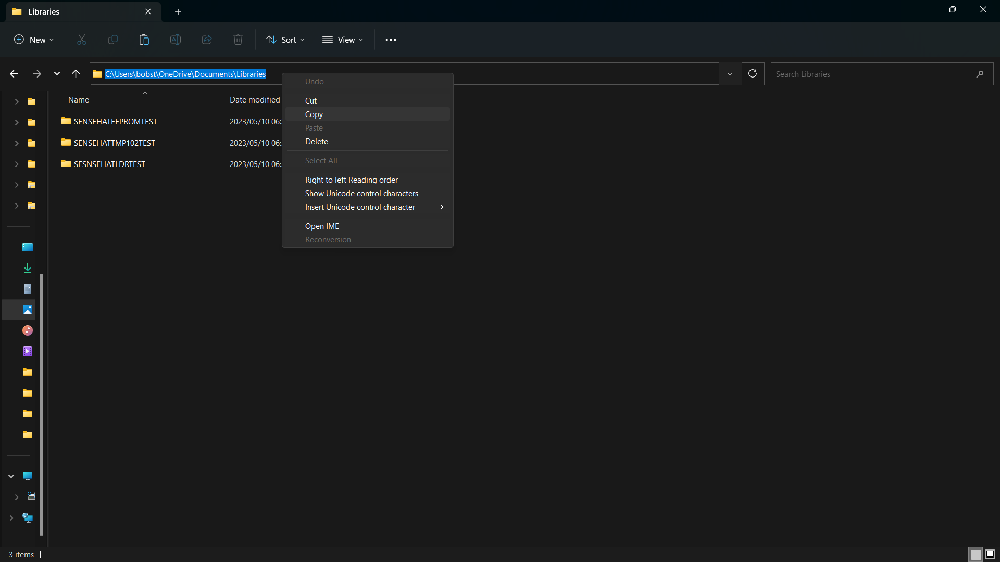
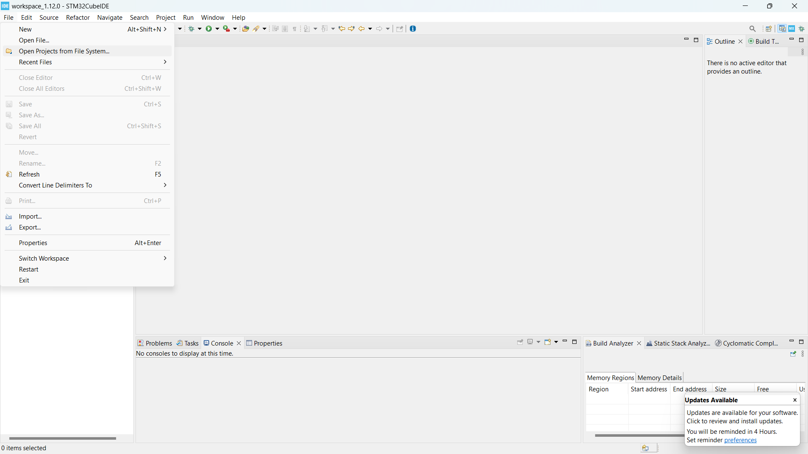
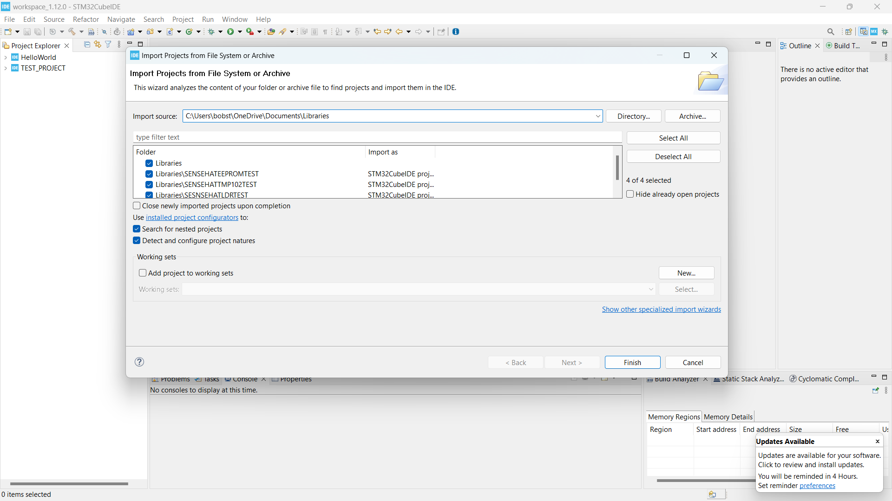
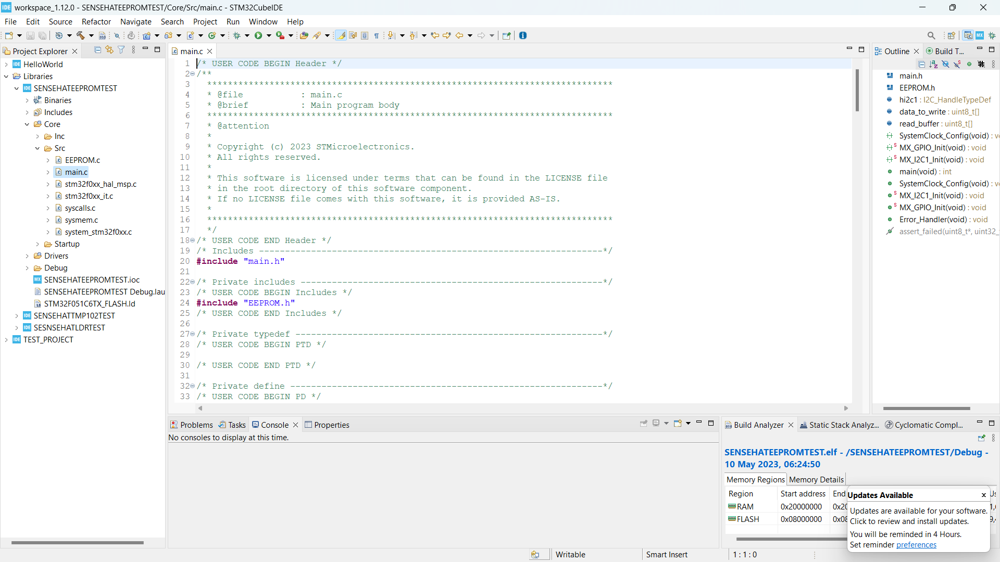

# Setting up the SENSEHAT for the first time.

### STEP1. Powering and setting up the SENSEHAT hardware.
**CAUTION:** Ensure that the power source supplies maximum of 5V at 3mA.

Follow this steps to set up you SENSEHAT.

  1. Connect the power source to the HAT via the USB cable.The LED should go on to indicate it is on.
  2. Let the battery charge for an hour, the green LED will go on when fully charged.
  3. Unplug the power supply and plug in the STM32F0 to the SENSEHAT as shown below.
  
  
  
### Step2. Include libraries to the SENSEHAT.
  1. Download and include the LDR files by following this [instructions](https://github.com/Travimadox/STM32SESNSEHAT/tree/main/Firmware).
  2. Download and include the TMP102 (temperature sensor) [files](https://github.com/Travimadox/STM32SESNSEHAT/tree/main/Firmware/TMP102) by following this [instructions](https://github.com/Travimadox/STM32SESNSEHAT/blob/main/Firmware/TMP102/Instructions.md).
  3. Download the [LTR303ALS file](https://github.com/Travimadox/STM32SESNSEHAT/tree/main/Firmware/LTR303ALS) and follow this [instruction](https://github.com/Travimadox/STM32SESNSEHAT/blob/main/Firmware/LTR303ALS/Instructions.md) to include them in your project.
  4. Download and include the RTC [files](https://github.com/Travimadox/STM32SESNSEHAT/tree/main/Firmware/RTC) by following this [instructions](https://github.com/Travimadox/STM32SESNSEHAT/blob/main/Firmware/RTC/Instructions.md).
  5. Download and include the AT24C256 (EEPROM) [files](https://github.com/Travimadox/STM32SESNSEHAT/tree/main/Firmware/AT24C256) by following this [instructions](https://github.com/Travimadox/STM32SESNSEHAT/blob/main/Firmware/AT24C256/Instructions.md).
### Step3: Test the Libraries.
  1. Download test [files](https://github.com/Travimadox/STM32SESNSEHAT/blob/main/Firmware/SENSEHATLIBTESTS.zip).
  2. Copy the file directory.
  
  
  
  3. Go to file in the STM32cubeIDE, select "Open projects from file system".
  
  
  
  4. In the open dialogue, paste the file directory in the "import source" block.
  
  
  5. Expand the Libraries folder>>SENSEHATEEPROMTEST>>core>>Src then open the main.c file.
  
  
  
  6. Run the code!
  7. Follow the steps **2-to-6** above to test for other libraries.
